# 富商笔记软件 V1.0 用户手册

## 1. 软件概述

富商笔记软件是一款移动端云笔记应用,为个人用户提供笔记的创建、编辑、同步与管理服务。软件采用前后端分离架构:客户端基于 React Native 跨平台框架开发,支持 iOS 与 Android;服务端基于 Node.js (Express) 与 MySQL 数据库,通过 RESTful API 提供数据服务,支持多设备登录同一账号后查看同一份笔记数据。

软件主要功能包括:

| 功能模块 | 功能说明 |
|---|---|
| 用户注册登录 | 邮箱/用户名 + 密码注册登录,基于 JWT 令牌鉴权,支持修改密码 |
| 笔记管理 | 笔记的新建、编辑、删除、恢复,支持 Markdown 语法编辑与实时预览 |
| 收藏置顶 | 收藏笔记并置顶显示,快速定位重要内容 |
| 标签管理 | 自定义彩色标签,笔记可关联多个标签,支持按标签筛选笔记 |
| 关键词搜索 | 对笔记标题与正文进行模糊搜索 |
| 回收站 | 删除笔记进入回收站,支持恢复与彻底删除,防止误删 |
| 排序展示 | 按更新时间、创建时间或标题排序 |
| 草稿自动保存 | 编辑过程中自动保存草稿,异常退出后可找回 |
| 个人中心 | 修改昵称、修改密码、管理标签、退出登录 |

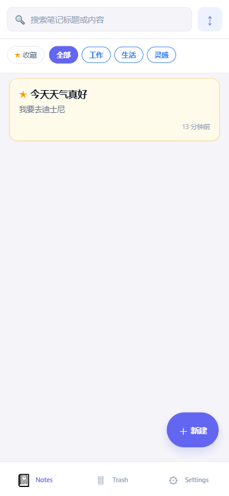

## 2. 运行环境

### 2.1 客户端(移动端 App)

| 项目 | 要求 |
|---|---|
| 操作系统 | Android 8.0 及以上 / iOS 13.0 及以上 |
| 硬件配置 | 内存 2GB 及以上,存储空间剩余 100MB 及以上 |
| 网络环境 | 需要接入互联网(Wi-Fi 或移动数据) |

### 2.2 服务端

| 项目 | 要求 |
|---|---|
| 操作系统 | Linux(CentOS 7+ / Ubuntu 18.04+)或 Windows Server |
| 运行环境 | Node.js ≥ 18.0 |
| 数据库 | MySQL ≥ 8.0 |
| 硬件配置 | 1 核 CPU / 2GB 内存及以上 |

## 3. 用户注册与登录

### 3.1 登录

启动应用进入登录界面。在输入框中填写已注册的邮箱(或用户名)与密码,点击"登录"按钮完成登录。

- 密码输入框右侧有"眼睛"图标,点击可切换密码明文/密文显示;
- 登录界面下方提供"没有账号?去注册"入口;
- 界面底部提示演示账号,便于快速体验。

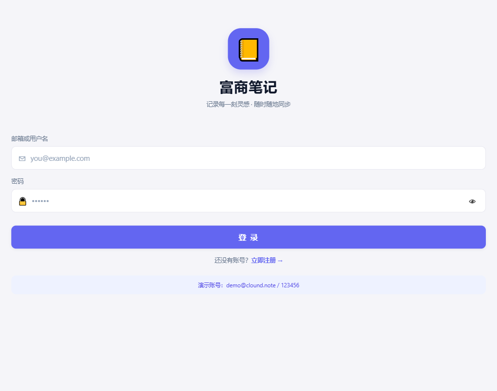

### 3.2 注册

点击登录界面的"去注册"进入注册界面。依次填写邮箱、用户名、密码与确认密码,其中:

- 邮箱、用户名、密码为必填项;
- 密码长度至少 6 位;
- 界面提供密码强度进度条,以红、黄、蓝、绿四档颜色实时提示密码强度。

填写完成后点击"注册"按钮。注册成功后自动登录并进入笔记列表。

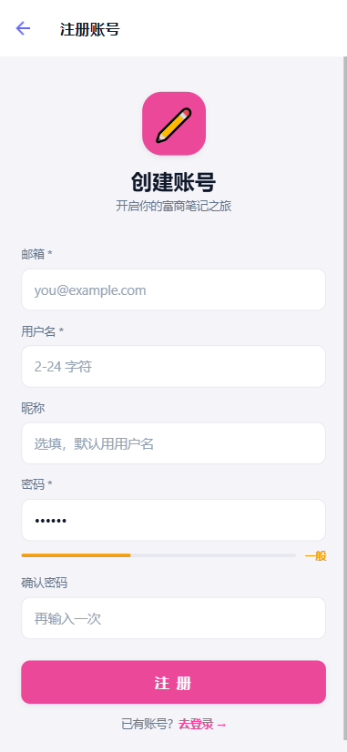

### 3.3 密码修改

登录后进入"我的"页面,在"修改密码"区域依次输入原密码、新密码(至少 6 位)与确认新密码,点击"修改密码"按钮。修改成功后页面顶部弹出"密码修改成功"提示。

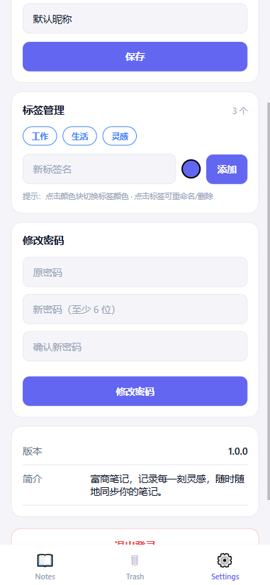

## 4. 笔记列表

登录后默认进入笔记列表页,顶部为搜索栏与筛选区,主体为笔记卡片列表。

### 4.1 搜索

点击顶部搜索框输入关键词,系统对笔记标题与正文进行模糊匹配,列表实时显示匹配结果。清空搜索框后恢复全部列表。

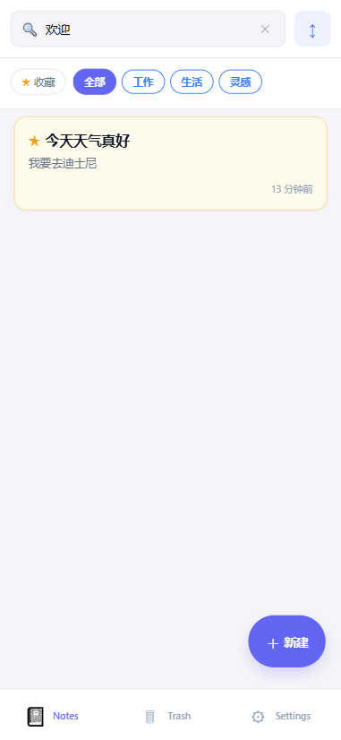

### 4.2 收藏筛选

筛选区左侧为"★ 收藏"按钮,点击后仅显示已收藏笔记;再次点击恢复显示全部。

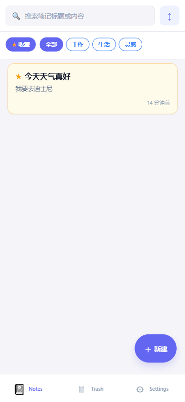

### 4.3 标签筛选

筛选区中部横向排列用户全部标签,超出屏幕宽度时支持左右滑动。点击任一标签,列表仅显示关联该标签的笔记;点击"全部"恢复显示全部笔记。

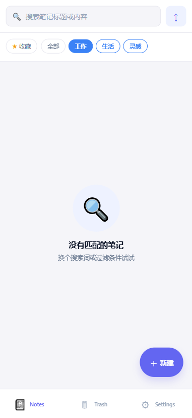

### 4.4 排序

点击筛选区的排序按钮,底部弹出排序选项(更新时间 / 创建时间 / 标题),选择后列表按所选方式重新排序。

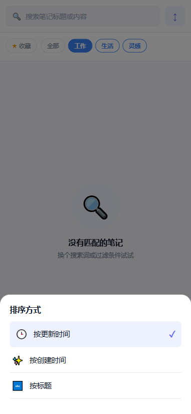

### 4.5 下拉刷新

在列表顶部下拉可刷新数据,与服务端同步最新笔记状态。加载过程中显示骨架屏占位。

### 4.6 笔记卡片

每张卡片显示笔记标题、正文预览(自动去除 Markdown 标记)、更新时间与关联标签。已收藏笔记以高亮底色显示并带星标标识。

### 4.7 新建笔记

点击右下角"新建"悬浮按钮,进入笔记编辑页创建新笔记。

## 5. 笔记编辑

### 5.1 编辑与预览

编辑页顶部标题栏下方提供"编辑 / 预览"切换按钮:

- **编辑模式**:输入框支持 Markdown 语法,可直接输入文字与标记;
- **预览模式**:实时渲染 Markdown 格式,支持标题(#/##/###)、无序与有序列表、粗体、斜体、行内代码、代码块、引用、分隔线等语法。

### 5.2 保存

点击右上角"保存"按钮保存笔记。保存过程中标题栏下方显示"保存中…",成功后显示"已保存 HH:mm"。除手动保存外,软件在编辑过程中每 2 秒自动保存草稿,异常退出后重新进入可恢复草稿内容。

### 5.3 收藏与标签

点击右上角星形图标可收藏/取消收藏当前笔记;点击标签图标弹出标签选择面板,勾选或取消勾选标签,亦可在面板中直接输入名称、选择颜色后新建标签。

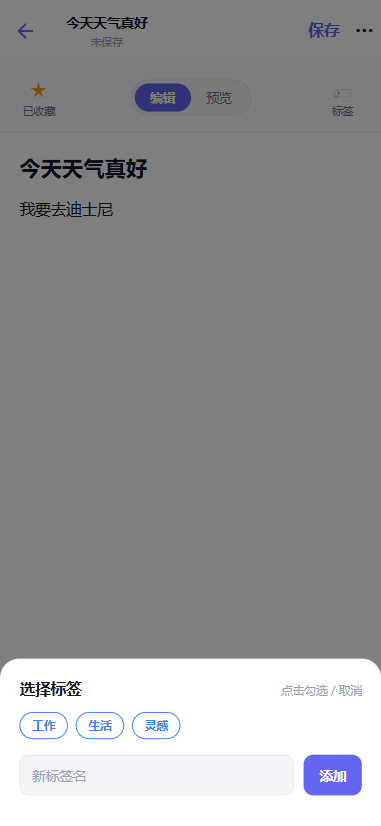

### 5.4 字数统计

编辑页底部状态栏实时显示当前字数、字符数与标签数量。

### 5.5 更多操作

点击右上角"…"按钮弹出更多菜单,提供以下操作:

| 操作 | 说明 |
|---|---|
| 复制为新笔记 | 以当前笔记内容为模板创建一篇新笔记 |
| 复制正文 | 将笔记正文复制到系统剪贴板 |
| 删除 | 将当前笔记移入回收站(需二次确认) |

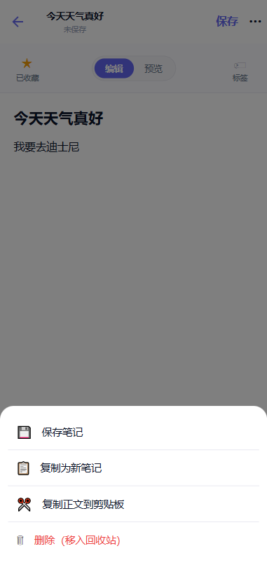

## 6. 回收站

在底部导航栏点击"回收站"进入。回收站内显示所有已删除笔记,卡片右上角以红色角标显示删除时间。

- **恢复**:点击笔记卡片上的"恢复"按钮,笔记回到笔记列表;
- **彻底删除**:点击"彻底删除"并二次确认后,笔记数据永久清除;
- **清空回收站**:点击右上角"清空"按钮并确认后,回收站内全部笔记永久删除。

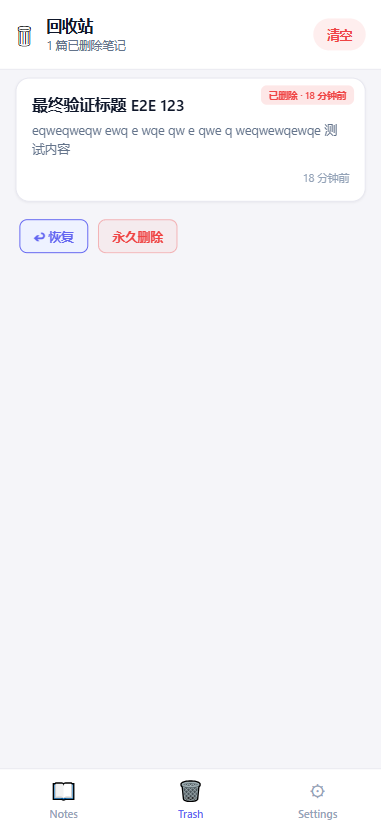

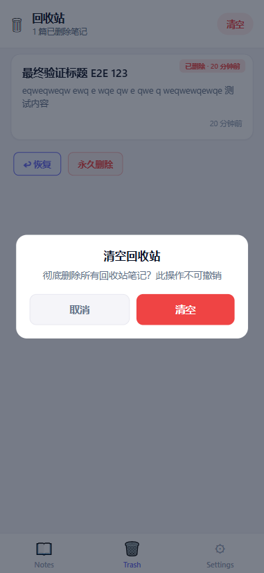

## 7. 个人中心(设置)

在底部导航栏点击"我的"进入个人中心。顶部为用户信息卡片,显示首字母头像与当前昵称。

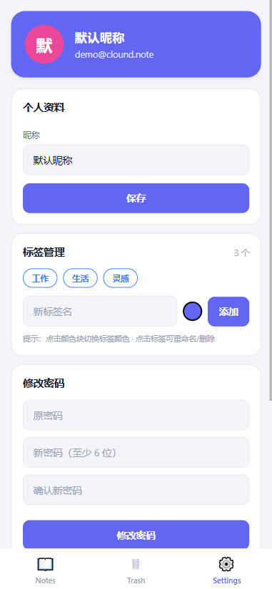

### 7.1 资料修改

在"昵称"输入框中输入新昵称,点击"保存昵称"完成修改,顶部弹出修改成功提示,头像色块随之更新。

### 7.2 标签管理

标签管理区域以彩色圆点形式展示全部标签:

- **新建**:在"新标签名"输入框输入名称,点击颜色圆点选择颜色(系统提供 7 种预设颜色循环切换),点击"添加"完成;
- **编辑**:点击已有标签弹出编辑面板,可修改标签名称与颜色,点击"保存"生效;
- **删除**:在编辑面板中点击"删除"并二次确认后,该标签被删除,相关笔记的标签关联自动解除。

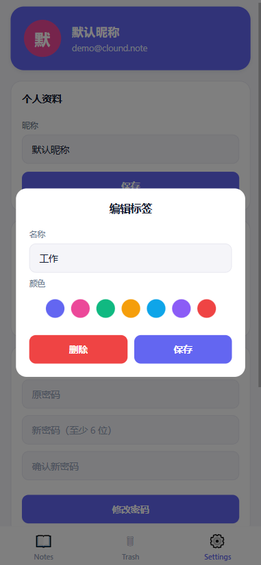

### 7.3 关于

"关于"区域显示软件版本号与简介。

### 7.4 退出登录

点击底部"退出登录"按钮,弹出确认弹窗,确认后清除本地登录凭证并返回登录界面。

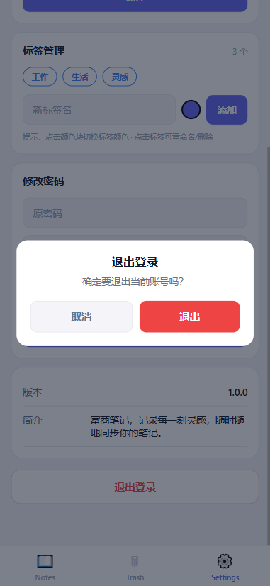

## 8. 常见问题

| 问题 | 处理方法 |
|---|---|
| 登录提示"用户名或密码错误" | 检查输入是否正确;若忘记密码,联系管理员在数据库侧重置 |
| 列表数据不更新 | 在列表页下拉刷新;检查网络连接 |
| 保存失败 | 检查网络;稍后重试,系统会在下次保存时同步最新内容 |
| 误删笔记 | 进入"回收站"找到笔记点击"恢复"即可 |
| 服务器地址变更 | 由发布方更新客户端配置后重新分发安装包 |

---

(用户手册全文结束)
